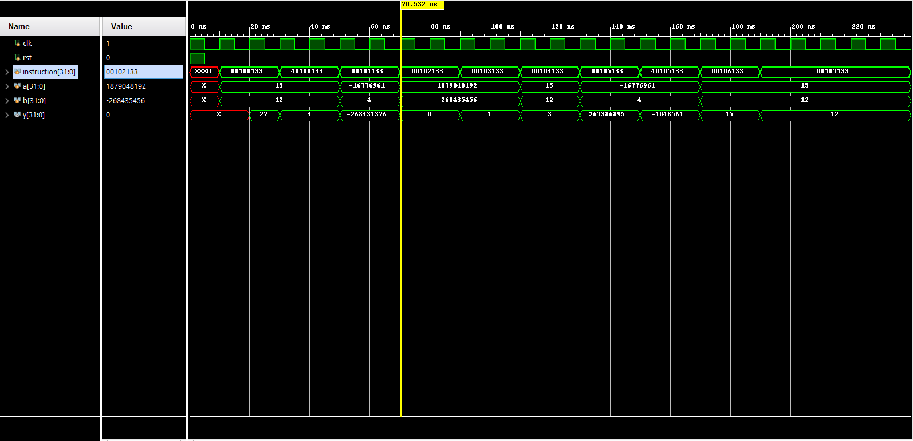

    Copyright(c) 2022-
    Author: Chaitanya Tejaswi (github.com/CRTejaswi)    License: GPL v3.0+

# CPU Design
> 32-bit CPU Design.

# Implementations

## [v1](v1/): 10 function
__Documentation__: [📄](docs/v1.pdf)  
__Reports__: [timing](v1/reports/timing.txt), [power](v1/reports/power.txt)  
__Features__:  

- Register Bank (32): R0-R31.
- No flag register.
- ALU Operations (10): ADD SUB SLL SLT SLTU XOR SRL SRA OR AND.
- Memory-Addressable instructions only (no immediate/conditional instructions).
- Instructions are directly fed by testbench instead of dedicated instruction memory.
- Testbench feeds A,B, and monitors A,B,Y for changes.
- Testbench feeds instruction to decoder which relays I/O info to register bank & control instructions to controller.
- Register bank feeds input to ALU; controller feeds execution logic to ALU. The results are written back to `rd` in register bank.

 
 

__Results__  

 
 
 
, SRL/SRA"> 
 
 

## [v2](v2/): + pipelining
__Documentation__: [📄](docs/v2.pdf)  
__Reports__: [timing](v1/reports/timing.txt), [power](v1/reports/power.txt)  

# References
